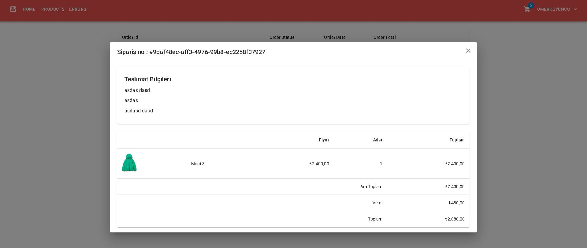
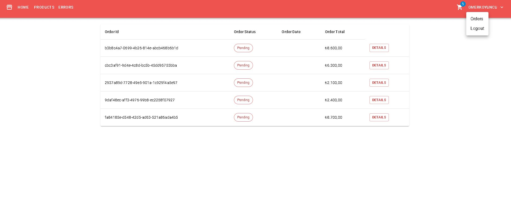
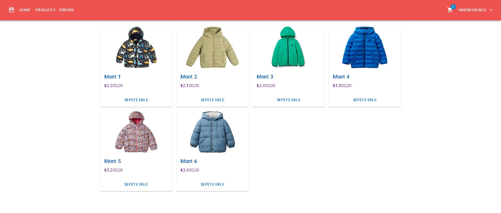
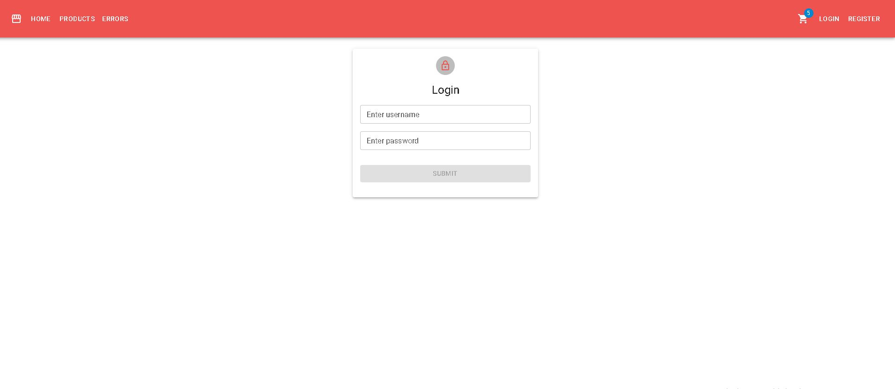

# 🛒 Store App

Store App, React ve Redux Toolkit kullanılarak geliştirilmiş modern bir e-ticaret uygulamasıdır. Kullanıcılar ürünleri görüntüleyebilir, sepete ekleyebilir, sipariş verebilir ve üye olup giriş yapabilir.

---

## 🖼 Önizleme

---

## ⚡ Özellikler
- 🔹 Ürün listeleme
- 🔹 Sepete ekleme ve sepet yönetimi
- 🔹 Sipariş oluşturma
- 🔹 Kullanıcı kaydı (Sign Up)
- 🔹 Kullanıcı girişi (Login)
- 🔹 Toast bildirimleri ile kullanıcı dostu responsive arayüz
- 🔹 Modern UI (Material-UI kullanıldı)
- 🔹 Client-side caching ile performanslı veri yönetimi
- 🔹 Cookie yönetimi ile kullanıcı oturum kontrolü

---

## 🛠 Kullanılan Teknolojiler
- [React](https://reactjs.org/)
- [Vite](https://vitejs.dev/)
- [Redux Toolkit](https://redux-toolkit.js.org/)
- [React Router](https://reactrouter.com/)
- [Material-UI](https://mui.com/)
- [React Hook Form](https://react-hook-form.com/)
- [Axios](https://axios-http.com/)
- [React Toastify](https://fkhadra.github.io/react-toastify/introduction)

---

